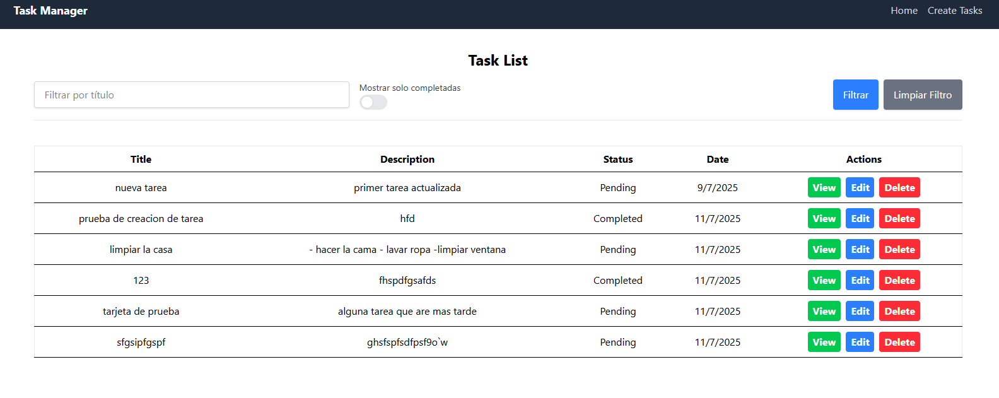
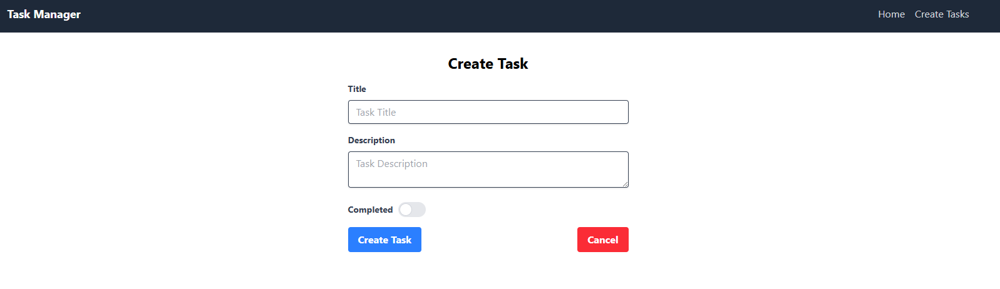
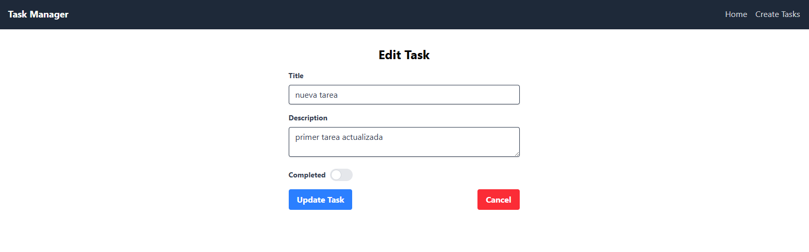
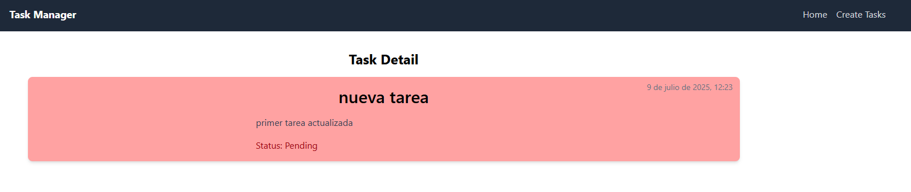

# Task Manager

Task Manager es una aplicación para gestionar tareas y retos personales. Permite crear, editar, eliminar y marcar tareas como completadas, ayudando a organizar y alcanzar objetivos diarios.

## Características

- Crear y editar tareas
- Eliminar tareas
- Marcar tareas como completadas
- Interfaz intuitiva y fácil de usar

## Instalación

1. Clona el repositorio:
    ```bash
    git clone https://github.com/sebamoccagatta/TaskManager.git
    ```
2. Instala las dependencias:
    - En el Root
        ```bash
        npm install
        ```
    - En el Server
        ```bash
        npm install
        ```
    - En el Client
        ```bash
        npm install
        ```
3. Inicia la aplicación desde el Root:
    ```bash
    npm start
    ```

## Uso

Accede a la aplicación y comienza a agregar tus tareas y retos. Organiza tu día y sigue tu progreso.

## Capturas
- Home
 
- Create

- Update

- Detail


## Contribución

Las contribuciones son bienvenidas. Por favor, abre un issue o envía un pull request.

## Licencia

Este proyecto está bajo la licencia MIT.